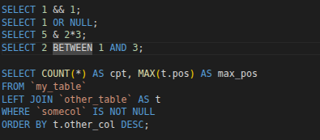

# MariaDB Syntax

Syntax highlighting for MariaDB in VS Code. Open a `.sql` file and your keywords, functions, table names, and strings each get their own color — long queries become easier to read and typos become easier to spot. Works for plain MySQL too (most of the language overlaps).



## Install

Symlink the repo into VS Code's extension directory:

```bash
ln -s "$PWD" ~/.vscode/extensions/rubin.mariadb-syntax-0.1.0
```

Restart VS Code once. After that, pulls of new changes take effect via **Ctrl+Shift+P → "Developer: Reload Window"** in any window that has a MariaDB file open — no repackage, no reinstall.

If you later install a packaged `.vsix` of this extension, remove the symlink first to avoid two copies being registered.

## Make it apply to your `.sql` files

VS Code's built-in SQL mode stays the default for `.sql`. To hand those files over to MariaDB, add this to your user settings or a workspace `.vscode/settings.json`:

```jsonc
{
  "files.associations": {
    "*.sql": "mariadb"
  }
}
```

Or per file: **Change Language Mode** (Ctrl+Shift+P) → **MariaDB**.

Why opt-in? There are several `.sql`-using extensions (the built-in SQL mode, the `mssql` / `mysql` marketplace ones). Auto-claiming the extension leads to them all fighting over the same files — a long-standing complaint against the upstream this is forked from.

## Working on the highlighting rules

To iterate on `syntaxes/MariaDB.tmLanguage`, use VS Code's Extension Development Host:

1. Open this repo in VS Code: `code .`
2. Press **F5** (wired up by `.vscode/launch.json`). A second window opens, titled `[Extension Development Host]`, with the extension loaded from source.
3. In the child window, open the **`examples/` folder** (File → Open Folder → `examples/`). It has to be a different folder than the parent window — VS Code refuses to open the same folder twice. The `.sql` files in `examples/` auto-associate to MariaDB via `examples/.vscode/settings.json`.
4. Edit the syntax file in the parent window, then press **Ctrl+R** in the child window to reload it.
5. Put the cursor on a token and run **Ctrl+Shift+P → "Developer: Inspect Editor Tokens and Scopes"** to see the exact scope chain. This is the primary debugging tool for this kind of work — use it before guessing at regex fixes.

No build step. The `.tmLanguage` file is read directly by VS Code.

## Building a .vsix

Requires `pnpm` and Node (or just Node with corepack enabled — it will fetch the pinned pnpm automatically).

```bash
./package.sh
```

Produces `mariadb-syntax-<version>.vsix` in the repo root. Install it with:

```bash
code --install-extension mariadb-syntax-<version>.vsix
```

CI builds the same artifact on every push to `develop` (available as a workflow artifact) and attaches it to a GitHub Release on `v*` tags.

## Credits

Forked from [jakebathman/mysql-syntax](https://github.com/jakebathman/mysql-syntax) (unreleased `jlb/2.0` branch), itself derived from [adael/sublimetext-mysql-syntax](https://github.com/adael/sublimetext-mysql-syntax). Licensed MIT; see `LICENSE`.
